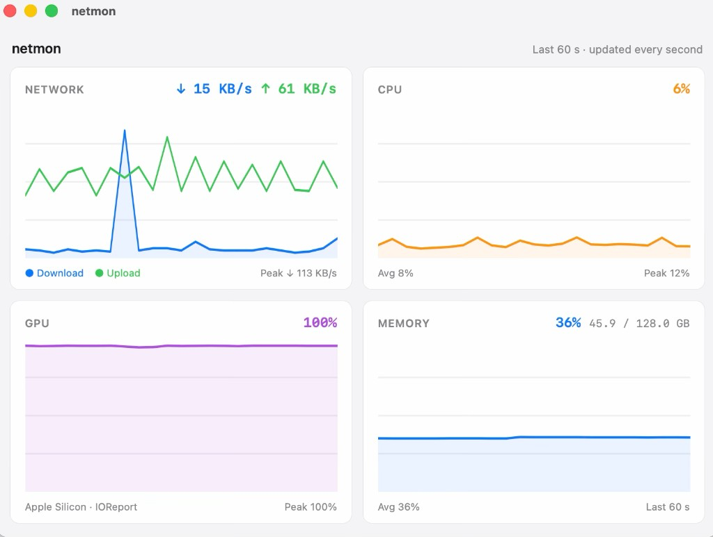

<div align="center">


# netmon

**A lightweight macOS menu bar app for real-time network, CPU, RAM & GPU monitoring.**

[](https://github.com/j3ffwin5tonone/netmon/releases)
[](https://github.com/j3ffwin5tonone/netmon/releases)
[](https://tauri.app)
[](package.json)

*Live metrics in your menu bar — click for a full dashboard with 60-second history.*

<!-- Screenshot: replace with a real capture of the dashboard window -->


</div>

---

## Highlights

- **Menu bar first** — download/upload, CPU, RAM and GPU live in your tray title:
  `↓ 12.3 MB/s ↑ 1.2 MB/s · CPU 23% · RAM 67% · GPU 15%`
- **One-click dashboard** — four clean cards with 60-second history charts, updated every second
- **GPU on Apple Silicon** — graphics utilization via IOReport, **no `sudo` required**
- **Tiny footprint** — native Rust backend (Tauri 2), no Electron
- **Free & open source** — MIT licensed

## Install

Grab the latest `.dmg` from the **[Releases page](https://github.com/j3ffwin5tonone/netmon/releases)**, drag `netmon.app` to Applications, launch — the icon appears in your menu bar.

> **Note:** GPU metrics are available on Apple Silicon only. On Intel Macs the GPU card shows "n/a"; everything else works normally.

## Usage

| Action | Result |
|--------|--------|
| **Left-click** tray icon | Open the dashboard window |
| **Right-click** tray icon | Menu → Quit |

## Metrics

| Metric | Source | Notes |
|--------|--------|-------|
| Network | [`sysinfo`](https://crates.io/crates/sysinfo) | Per-interface byte delta per second |
| CPU | `sysinfo` | Global usage across all cores |
| RAM | `sysinfo` | Used vs. total memory |
| GPU | [`macmon`](https://github.com/vladkens/macmon) | Apple Silicon, IOReport (relative to max GPU frequency) |

## Building from source

Requirements: [Node.js](https://nodejs.org/) 18+, [Rust](https://rustup.rs) (stable), Xcode Command Line Tools.

```bash
git clone https://github.com/j3ffwin5tonone/netmon.git
cd netmon
npm install
npm run tauri dev      # development
npm run tauri build    # release build → src-tauri/target/release/bundle/macos/
```

## Architecture

```
netmon/
├── src/                 # SvelteKit frontend (dashboard, charts)
│   └── lib/components/  # NetworkChart, CpuChart, GpuChart, MemoryChart
└── src-tauri/           # Tauri 2 / Rust backend
    └── src/metrics/     # cpu, memory, network, gpu collectors
```

The backend collects a `MetricsSnapshot` every second and emits it to the frontend via the `metrics-update` event. History is a 60-entry ring buffer; GPU sampling runs on a dedicated thread.

## Acknowledgments

[Tauri](https://tauri.app) · [SvelteKit](https://kit.svelte.dev) · [sysinfo](https://crates.io/crates/sysinfo) · [macmon](https://github.com/vladkens/macmon)

## License

MIT
